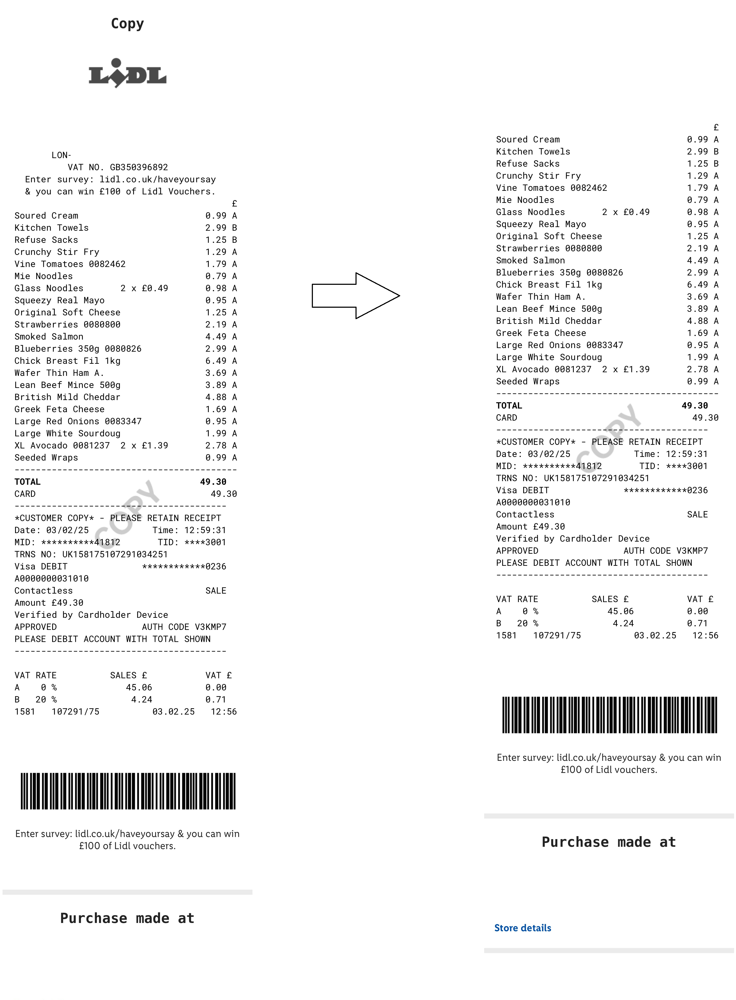
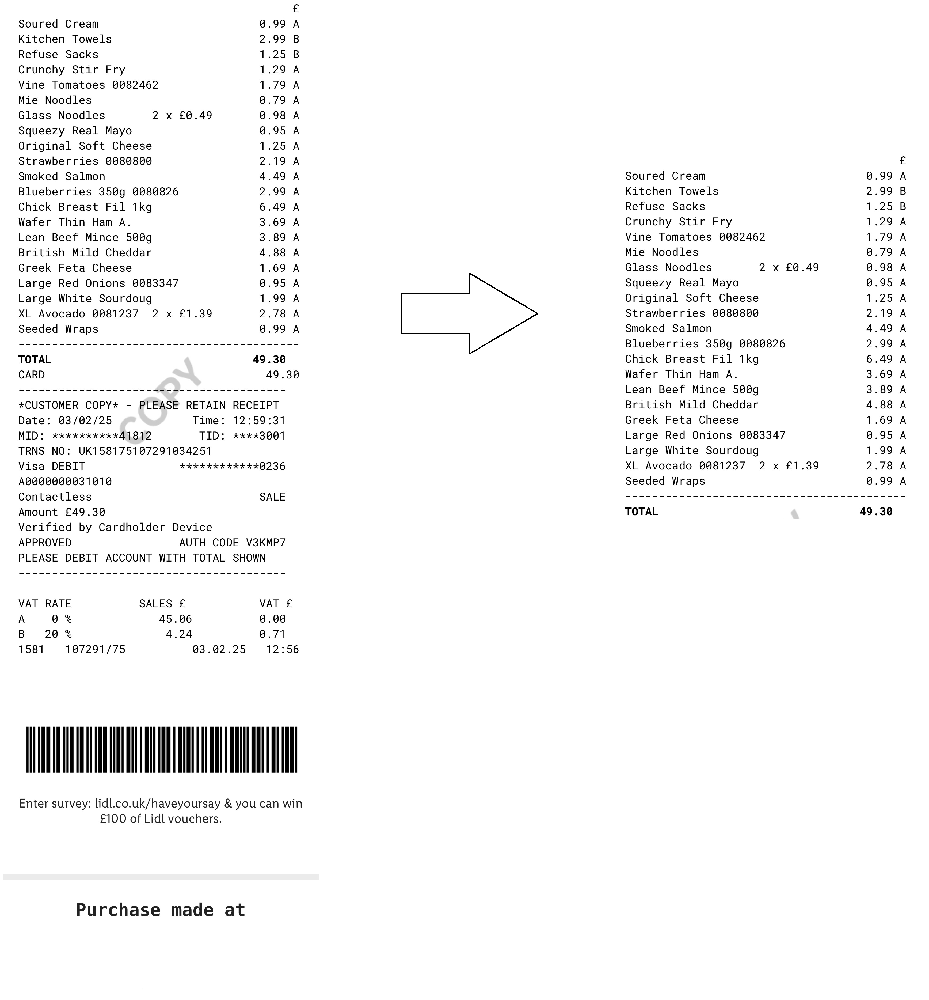

# The Beginning

## Summary

I am planning to build What Am I Buying (name may or may not be changed). As input, the application will take a date/time value, which will imply when the user will go grocery shopping.

The application will output predictions of what the user will buy, given the date/time provided by the user.

To build up the accuracy of the application's predictions, the user will input pictures of grocery shopping receipts.

The application will categorise the items by type and mostly ignore brand preferences (i.e. Pepsi and Coca Cola would both be chucked into the Cola/Soft Drink category).

## Motivations

I decided to pursue this project for the following reasons:

1. I love data-based solutions;
2. More hands-on experience with LLM's;
3. More hands-on experience with Golang;
4. More hands-on experience with deployments;
5. Possibility of building a wider knowledge of tools used in the industry;
6. Having a cutting/bleeding edge sandbox codebase;
7. I am interested in doing some more data analysis on my shopping habits.

## Concept of working

The system can be broken down into the following components:

1. **Receipt Parsing**: Extract data from receipts (text, items, prices, etc.).
2. **Data Normalisation**: Standardize item names (e.g., "Coca Cola" and "Pepsi" → "Cola").
3. **Database Storage**: Store parsed and normalized data in a structured format.
4. **Prediction Engine**: Use historical data to predict the likelihood of purchasing specific items.
5. **User Interface**: Allow users to interact with the system (e.g., view predictions, input shopping plans).

A lot of bridges I'll cross when I get to, that's for sure. I will also pay double the price in time and effort, that's also for sure. But it's OK and I believe it's part of the learning curve.

### Receipt Parsing

This step will require the application to take a picture of a receipt, process it appropriately and (by some means) take the relevant text out of it.
*For examples, I have downloaded several receipts from the Lidl Plus app, which has digital receipts.*

**What's the solution for doing that?**

I have researched multiple options, let me go through them:

1. LLM
    - I started actually doing planning for this project after Deepseek dropped the R1 model, so I thought about running some of the lighter models locally, getting a fully offline solution. I then learned that for my use case I'd require a **vision model**, which disqualified all of the recent Deepseek models.
    - After looking up vision models, I downloaded Ollama and spun up **LLaVA**. The results were not satisfactory, neither the text nor the numbers looked too close to accuracy. After doing more research, many internet users said that LLM's simply aren't suitable to such a task in the big year of 2025 (yet). So I scrapped that idea.
2. Tesseract
    - After the LLM fiasco, I simply decided to give some good old OCR a go. I spun up Tesseract locally, tried parsing a cropped up receipt, and after cropping the image up just to contain the prices of all of the purchased things, I got a *reasonable* result. However some things were wrong:
        - Tesseract read all of the 0's as @'s (and other mess-ups in a very similar vein to this). It was fine running a `strings.ReplaceAll(content, "@", "0")` command for the test run, but I doubt it be a) feasible, b) consistent to have it replace all @'s for 0's in my 2+ years of grocery receipts.
        - It still wasn't as accurate as I would have liked. Some errors in the text part as well as numbers just meant that I probably needed a more consistent and accurate solution.
        - On these Lidl receipts, the discount text is in light blue, which caused a problem for Tesseract. I messed around with image processing to chew up the image so old boy Tesseract wouldn't have to work as hard, but I am just as bad at image processing as Tesseract is at... parsing text?
3. PaddlePaddle
    - After the Tesseract fiasco, I looked at other OCR solutions, knowing that a reasonable (and preferrably free) solution is out there. And I stumbled upon [PaddlePaddle](https://paddlepaddle.github.io/PaddleOCR/latest/en/index.html). It seems great, reasonably simple to spin up and gives accurate results. I'm sure our blossoming relationship will definitely turn more sour over time but for now I'm more than satisfied with PaddleOCR/PaddlePaddle.

The next problem is making processing the image automatic - I cannot be manually cropping dozens of receipts to only contain the things I bought, and the process can be, again, quite tricky.

To make my life easier in the beginning, I'll just take ~850 pixels off the top of the image to get to the meat and potatoes (hehe).

The bottom of the image is a bit trickier.

My options are: 

1. Locate the barcode and cut off the image just above that
2. Using PaddleOCR, find one of the phrases implying end of the grocery list. If you look at the image above, some of those could be: `TOTAL`, `CARD`, `\*CUSTOMER COPY\* - PLEASE RETAIN RECEIPT`. If this end phrase is located, stop parsing the text (or if PaddleOCR does it all at the same time, not word by word, just bin whatever comes after). However, I would like to cross-check that everything was parsed correctly by verifying that values in the price column add up to the total.

I like the second option quite a bit better so I'll probably pursue that. If this is done, I should be left only with the content that is useful in my particular use case.

## Notes

- To begin with, I will more or less hardcode Lidl UK receipt format for parsing, as it is a personal project and it is my primary place for shopping. Once the initial stuff is done, changing out the parsing for a more complex solution that could take in as many different grocery receipts as possible (I'll start with Sainsbury's - my second most frequented destination for food shopping).
- In quite a large part, I've pursued this project because of the digital receipt functionality in the Lidl Plus app. I hope that parsing crumbled and imperfect receipts is a feasible task (or at the very least the workload does not increase exponentially).